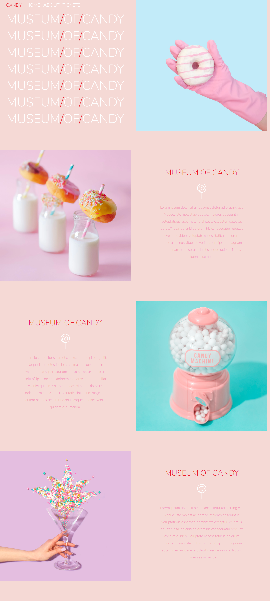
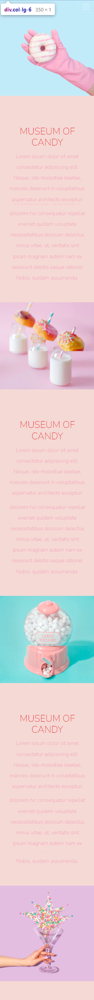

# Museum Of Candy - Web Bootcamp Project

This repository contains a Museum of Candy project that I built as part of Udemy's Web Development Bootcamp by Colt Steele. The website showcases a virtual museum of candy with a focus on creative design and interactive elements.

## Preview

## Features

- Responsive design using Bootstrap's grid system
- Creative use of Bootstrap components (e.g., navbar, cards, carousel, modals, etc.)
- Custom CSS to enhance Bootstrap's default styles
- Mobile-friendly layout

## Technologies Used

- HTML
- CSS (Bootstrap)

---
Feel free to explore the project, use it as a reference, and contribute to its improvement. If you have any questions or suggestions, please feel free to reach out. Happy coding! 😊
